# Pulp Classic Effects

A growing suite of **classic audio effects** built as [Pulp](https://www.generouscorp.com/pulp/)
SDK example plugins — each a small, self-contained `Processor` that compiles to
VST3 / CLAP / standalone (and AU / AUv3 / AAX where the platform SDKs are
available), with a headless test that asserts the actual DSP behavior.

The goal is a legible, recognizable showcase of "write one `Processor`, get
every plugin format" — using effects everyone knows (tremolo, delay, chorus,
flanger, phaser, wah, compressor, …) as the worked examples, alongside a couple
of small companion examples (a MIDI utility and a minimal instrument) that round
out the SDK contract surface.

## Status

| Effect | Editor | DSP | Test | Notes |
|---|---|---|---|---|
| Tremolo | 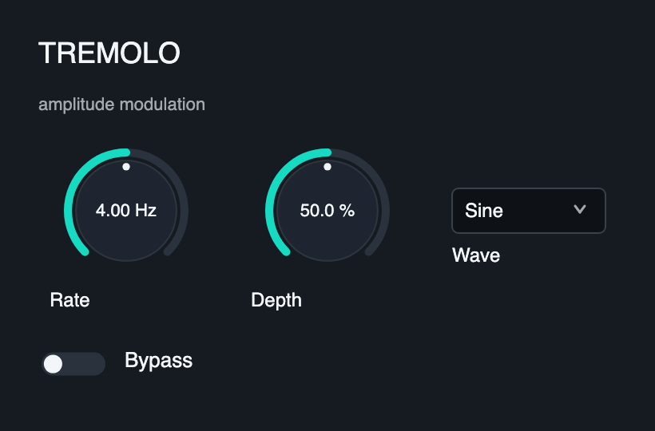 | ✅ | ✅ | Periodic amplitude modulation (sine/triangle/square LFO) |
| Ring Mod | 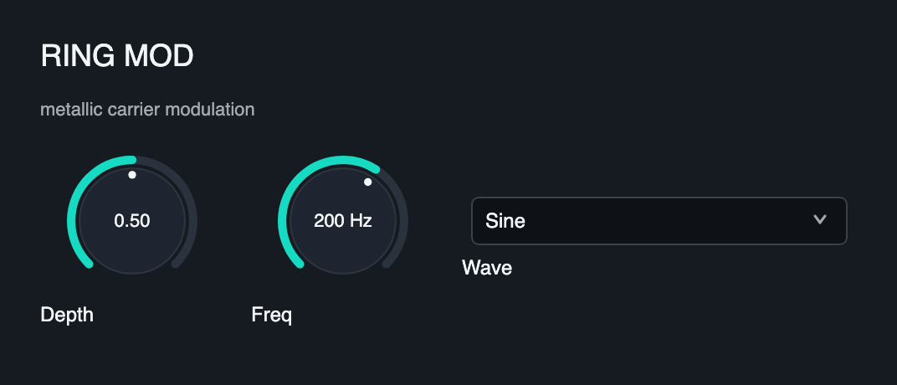 | ✅ | ✅ | Sine-carrier ring modulation with wet/dry mix |
| Delay | 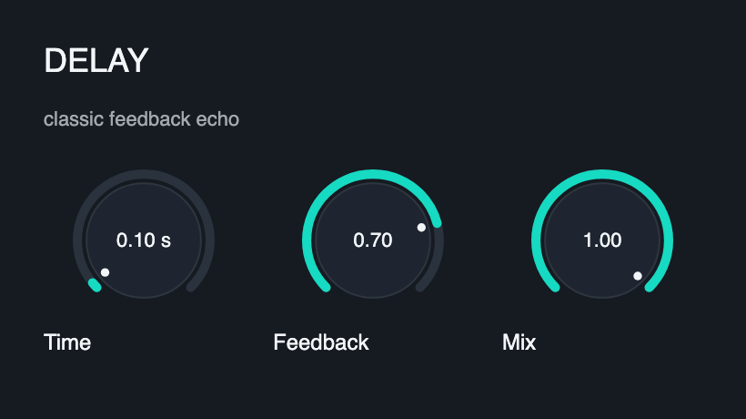 | ✅ | ✅ | Feedback delay line with wet/dry mix |
| Vibrato | 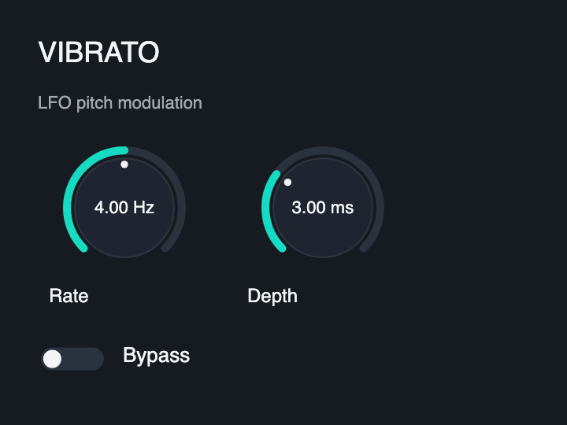 | ✅ | ✅ | LFO-swept fractional delay (pitch modulation) |
| Chorus | 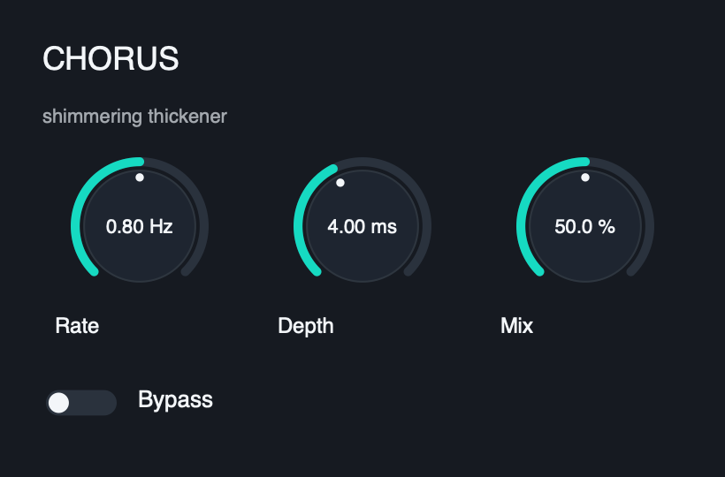 | ✅ | ✅ | LFO-swept short delay blended with the dry signal |
| Comp/Expander | 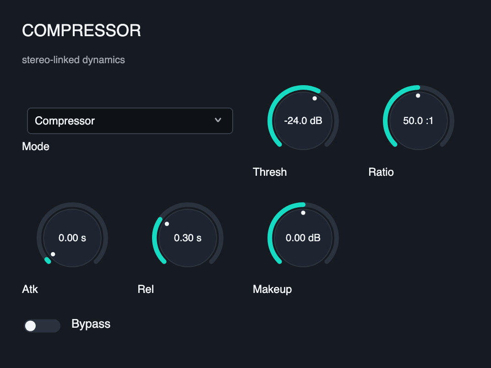 | ✅ | ✅ | Stereo-linked dynamics — compress above / expand below, with makeup |
| Parametric EQ | 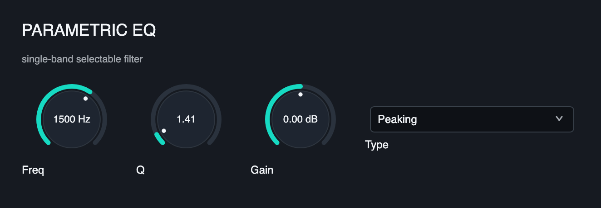 | ✅ | ✅ | Three-band EQ (low shelf / mid bell / high shelf), per-band freq/gain/Q |
| Wah | 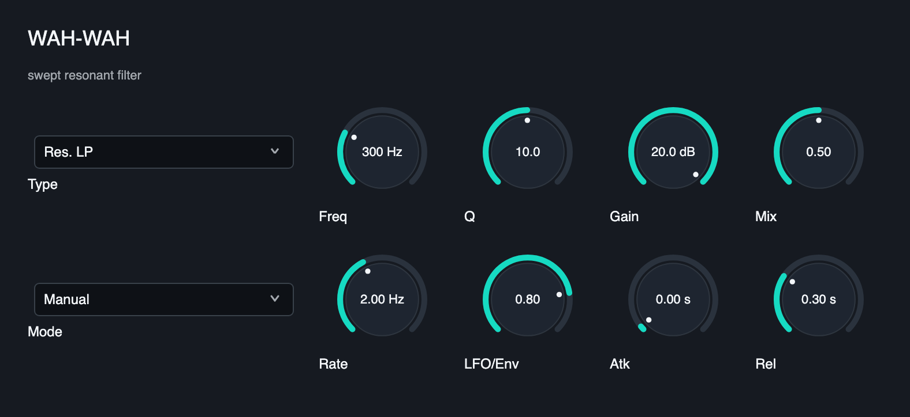 | ✅ | ✅ | Resonant bandpass swept manually or by the input envelope (auto-wah) |
| Pitch Shift | 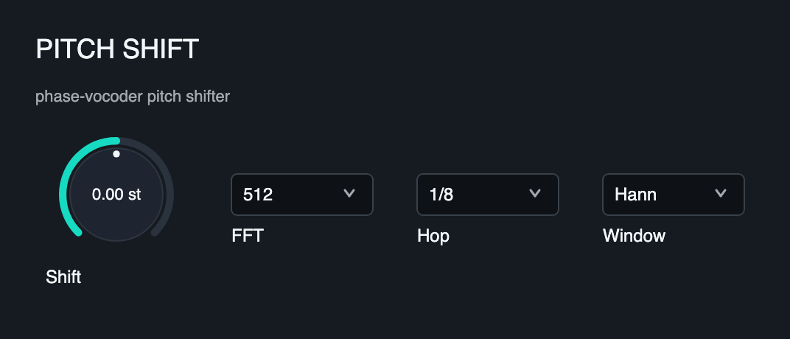 | ✅ | ✅ | ±12-semitone two-tap crossfading delay-line pitch shifter |
| Flanger | 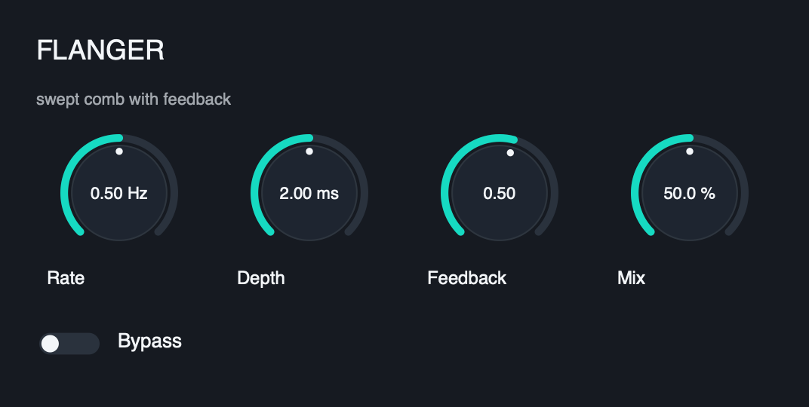 | ✅ | ✅ | Short LFO-swept delay with feedback — the resonant "jet" comb |
| Ping-Pong Delay | 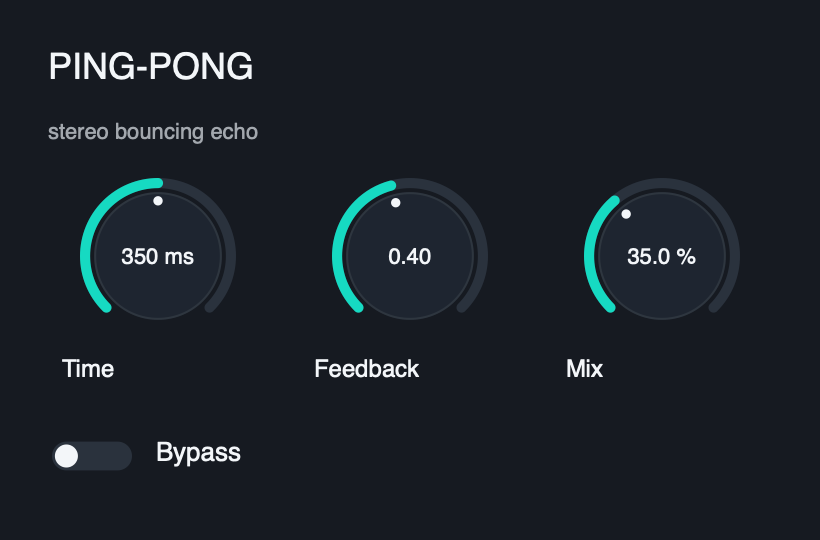 | ✅ | ✅ | Stereo cross-coupled delay; echoes bounce left↔right as they decay |
| Phaser | 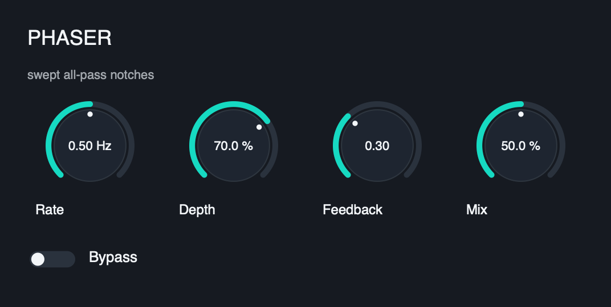 | ✅ | ✅ | Six cascaded swept all-pass stages + feedback → moving notches |
| Distortion | 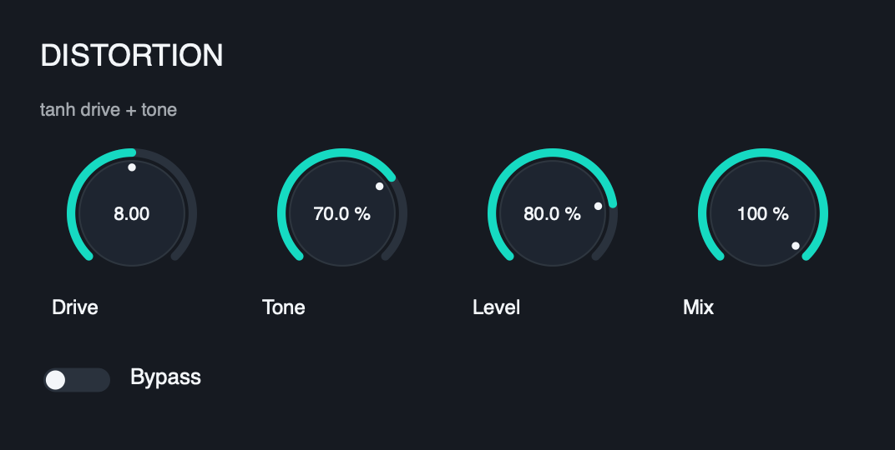 | ✅ | ✅ | tanh soft-clip drive with a one-pole tone tilt, level, and mix |
| Auto-Pan | 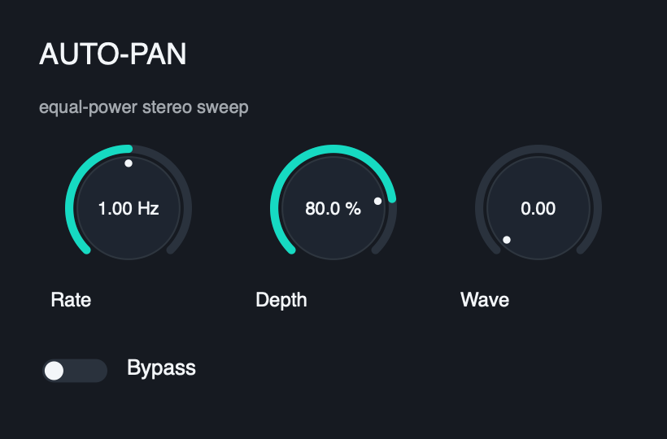 | ✅ | ✅ | Equal-power LFO stereo panner (sine/triangle/square) |
| Robotization | 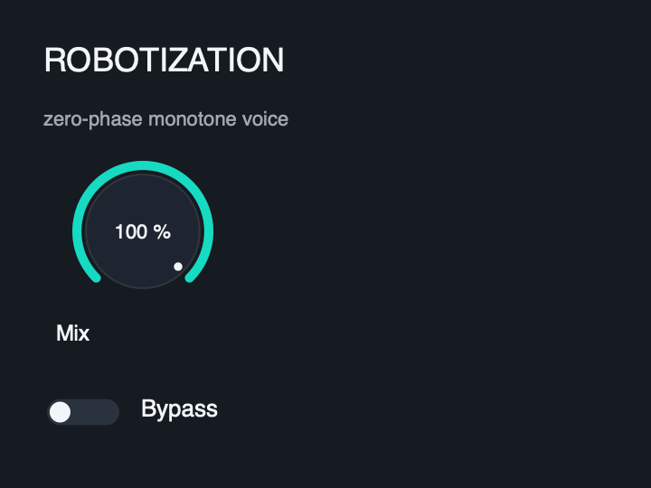 | ✅ | ✅ | STFT zero-phase resynthesis → fixed monotone "robot" pitch |
| _more effects_ | | planned | planned | flanger, ping-pong, phaser, distortion, panning, robotization, … |

Each effect also ships a dark **Ink & Signal** editor (see `*/*_editor.hpp` and
`test_editors.cpp`). Companion non-effect examples (a MIDI utility, a minimal
instrument, a UI fixture) live in
[pulp-example-plugins](https://github.com/danielraffel/pulp-example-plugins).

## Credits

Inspired by truce-audio's [reiss-mcpherson-effects](https://github.com/truce-audio/reiss-mcpherson-effects)
and [truce](https://github.com/truce-audio/truce), and the *Audio Effects* book
by Reiss & McPherson.

## License

MIT — see [LICENSE](LICENSE). See also [Pulp licensing](https://www.generouscorp.com/pulp/licensing.html).

## Building

These examples consume the Pulp SDK. The simplest path is to scaffold against an
existing Pulp checkout/install with `pulp create`, which pins the SDK and wires
the build for you. To build this repo directly:

```bash
cmake -S . -B build -DCMAKE_BUILD_TYPE=Release \
      -DCMAKE_PREFIX_PATH=/path/to/pulp/install
cmake --build build -j
ctest --test-dir build --output-on-failure
```

Each effect ships its behavioral test (built by default); the tests use the
Pulp SDK's reusable `pulp/format/validation_assertions.hpp` helpers
(`check_finite`, `check_peak_below`, `check_param_round_trip`,
`check_state_round_trip`, …).

### Editor screenshots

Each effect exposes its editor through `Processor::create_view()`, so the dark
Ink & Signal panel shown below is what loads in any VST3 / AU / CLAP host or the
standalone app — no extra wiring per format.

The `Editor` column above is rendered from the baselines in `screenshots/`.
`test_editors.cpp` builds each editor through `create_view()` (the real host
path), re-renders it with Skia, and compares it pixel-wise against its committed
baseline, so an unintended UI change fails CI. It also pushes every parameter
off its default and asserts the render visibly changes, proving the editor is
bound to live plugin state. After a deliberate editor change, rebake the
baselines:

```bash
PULP_BAKE_SCREENSHOTS=1 ctest --test-dir build -R editors --output-on-failure
git add screenshots && git commit -m "chore: rebake editor screenshots"
```

The test skips cleanly when the SDK build has no Skia raster backend.
